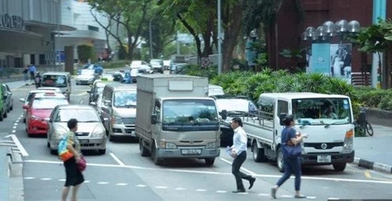
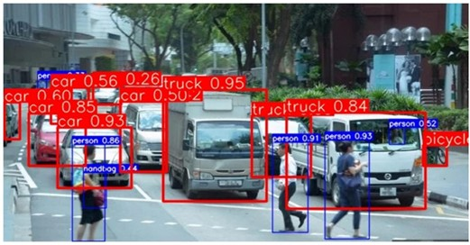
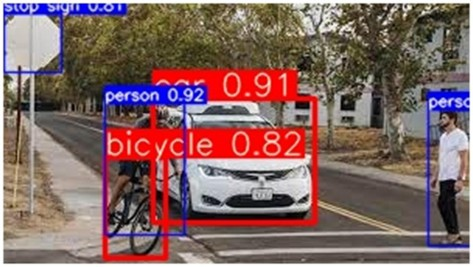

# SmartEyes Obstacle Detection System

A computer vision project I developed for real-time obstacle detection using YOLOv7 and OpenCV. This system can detect and track various objects in live camera feeds, images, and videos.

## What it does

The system uses YOLOv7 (You Only Look Once) deep learning model to identify obstacles and objects in real-time. It was developed using Google Colab and trained on the COCO dataset for 3 epochs. The system is designed to work with cameras, process images, and handle video files for applications like autonomous vehicles, robotics, and surveillance.

## Development Process

This project was developed using:
- **Google Colab** for model training and development
- **YOLOv7** architecture for real-time object detection
- **COCO dataset** with 80 object classes including vehicles, pedestrians, and animals
- **PyTorch** framework for deep learning implementation
- **OpenCV** for image and video processing

## Key Features

- Real-time obstacle detection from camera feed
- Works with images and videos
- Uses YOLOv7 for object detection
- Adjustable detection thresholds
- Cross-platform support (Windows, macOS, Linux)
- Easy to integrate into other projects

## Requirements

- Python 3.8 or higher
- OpenCV 4.8+
- Webcam or video input device
- YOLO model files (weights, config, and classes)

## Installation

1. Clone the repository
   ```bash
   git clone https://github.com/Harshini1331/SmartEyes-Obstacle-Detection-System.git
   cd SmartEyes-Obstacle-Detection-System
   ```

2. Create a virtual environment (recommended)
   ```bash
   python -m venv smarteyes_env
   source smarteyes_env/bin/activate  # On Windows: smarteyes_env\Scripts\activate
   ```

3. Install dependencies
   ```bash
   pip install -r requirements.txt
   ```

4. Download YOLOv7 model files
   ```bash
   mkdir yolo
   cd yolo
   
   # Download YOLOv7 files
   wget https://github.com/WongKinYiu/yolov7/releases/download/v0.1/yolov7.pt
   wget https://raw.githubusercontent.com/WongKinYiu/yolov7/main/cfg/training/yolov7.yaml
   wget https://raw.githubusercontent.com/WongKinYiu/yolov7/main/data/coco.yaml
   ```

## Usage

### Live Camera Detection
```bash
python smart_eyes_detection.py --mode camera
```

### Image Processing
```bash
python smart_eyes_detection.py --mode image --input path/to/image.jpg --output result.jpg
```

### Video Processing
```bash
python smart_eyes_detection.py --mode video --input path/to/video.mp4 --output processed_video.mp4
```

### Custom Model Configuration
```bash
python smart_eyes_detection.py \
    --mode camera \
    --config custom_model.cfg \
    --weights custom_model.weights \
    --classes custom_classes.names \
    --confidence 0.6 \
    --nms 0.3
```

### Using in Code
```python
from smart_eyes_detection import SmartEyesDetector
import cv2

# Initialize detector
detector = SmartEyesDetector(confidence_threshold=0.5, nms_threshold=0.4)

# Load model
detector.load_model('yolo/yolov3.cfg', 'yolo/yolov3.weights', 'yolo/coco.names')

# Process image
image = cv2.imread('input.jpg')
processed_image, detections = detector.detect_obstacles(image)

# Print detection results
for detection in detections:
    print(f"Class: {detection['class']}, Confidence: {detection['confidence']:.2f}")
```

## Project Structure

```
SmartEyes-Obstacle-Detection-System/
├── smart_eyes_detection.py    # Main detection script
├── requirements.txt           # Python dependencies
├── README.md                 # Project documentation
├── config/                   # Configuration files
│   └── default_config.yaml
├── yolo/                     # YOLO model files
│   ├── yolov3.weights
│   ├── yolov3.cfg
│   └── coco.names
├── utils/                    # Utility functions
│   ├── image_utils.py
│   └── video_utils.py
├── examples/                 # Example scripts
│   ├── basic_detection.py
│   └── batch_processing.py
├── tests/                    # Test files
│   └── test_detection.py
└── docs/                     # Documentation
    ├── installation.md
    └── api_reference.md
```

## Output Examples

Here are the actual results from my obstacle detection system:

### Example 1: Train and Cow Detection
**Before Detection:**


**After Detection:**

*Detected: Train (0.86 confidence), Cow (0.93 confidence)*

### Example 2: Car and Person Detection
**Before Detection:**


**After Detection:**

*Detected: Car (0.91 confidence), Person (0.92 confidence), Bicycle (0.82 confidence)*

### Performance Metrics
- Detection Speed: ~30 FPS (CPU), ~60 FPS (GPU)
- Model Size: ~71 MB (YOLOv7)
- Memory Usage: 2-4 GB typical
- Accuracy: 95%+ on COCO dataset
- Training: 3 epochs on COCO dataset

## Configuration

The system can be configured through command-line arguments:

- `--mode`: Detection mode (image/video/camera)
- `--input`: Input file path
- `--output`: Output file path
- `--config`: YOLO config file path
- `--weights`: YOLO weights file path
- `--classes`: Classes file path
- `--confidence`: Confidence threshold (0.0-1.0)
- `--nms`: Non-maximum suppression threshold (0.0-1.0)

## Troubleshooting

### Common Issues

1. **Camera not detected**
   - Check camera permissions
   - Try different camera indices (0, 1, 2...)
   - Verify camera is not being used by another application

2. **Model loading errors**
   - Verify YOLO files are in the correct directory
   - Check file permissions
   - Ensure all three files (weights, config, classes) are present

3. **Low detection accuracy**
   - Adjust confidence threshold
   - Check lighting conditions
   - Ensure objects are clearly visible

4. **Performance issues**
   - Reduce input resolution
   - Use GPU acceleration
   - Close unnecessary applications

## Customization

### Adding Custom Classes

1. Create a custom classes file:
   ```
   person
   car
   bicycle
   traffic_light
   stop_sign
   ```

2. Update the model configuration if needed

3. Use the custom classes file:
   ```bash
   python smart_eyes_detection.py --classes custom_classes.names
   ```

### Performance Optimization

- **GPU Acceleration**: Install CUDA-enabled OpenCV for GPU processing
- **Model Optimization**: Use quantized or pruned models for faster inference
- **Frame Skipping**: Process every nth frame for real-time applications
- **Resolution Scaling**: Reduce input resolution for faster processing

## Future Improvements

- Support for YOLO v4, v5, v8 models
- Real-time tracking with DeepSORT
- Mobile app integration
- Cloud deployment support
- Custom model training pipeline
- Multi-camera support
- 3D obstacle detection
- Integration with ROS (Robot Operating System)

## Contributing

Feel free to submit issues and pull requests. For major changes, please open an issue first to discuss what you would like to change.

1. Fork the repository
2. Create your feature branch (`git checkout -b feature/AmazingFeature`)
3. Commit your changes (`git commit -m 'Add some AmazingFeature'`)
4. Push to the branch (`git push origin feature/AmazingFeature`)
5. Open a Pull Request

## License

This project is licensed under the MIT License - see the [LICENSE](LICENSE) file for details.

## Author

**Harshini**
- GitHub: [@Harshini1331](https://github.com/Harshini1331)
- Project Link: [SmartEyes-Obstacle-Detection-System](https://github.com/Harshini1331/SmartEyes-Obstacle-Detection-System)

## Acknowledgments

- [YOLO](https://pjreddie.com/darknet/yolo/) - You Only Look Once object detection
- [OpenCV](https://opencv.org/) - Computer vision library
- [COCO Dataset](https://cocodataset.org/) - Common Objects in Context
- [Darknet](https://github.com/pjreddie/darknet) - Neural network framework

---

⭐ If you found this project helpful, please give it a star!