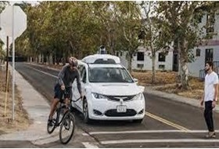

# SmartEyes Obstacle Detection System

## Project Overview

This project presents a computer vision-based obstacle detection system developed using YOLOv7 (You Only Look Once) deep learning architecture and OpenCV. The system is designed to identify and localize various objects and obstacles in real-time from camera feeds, images, and video streams.

## Problem Statement

Obstacle detection is a critical component in various applications including autonomous vehicles, robotics, and surveillance systems. The primary challenge addressed in this project is developing an efficient and reliable system that can accurately identify obstacles in real-time, enabling safe navigation and preventing potential collisions.

The system aims to overcome limitations of traditional detection methods by leveraging advanced computer vision techniques and deep learning algorithms to analyze input from cameras and provide robust obstacle detection capabilities.

## Methodology

### Technology Stack
- **YOLOv7**: State-of-the-art real-time object detection model
- **OpenCV**: Computer vision library for image and video processing
- **PyTorch**: Deep learning framework
- **Google Colab**: Development and training environment
- **COCO Dataset**: Training data with 80 object classes

### System Architecture

The system employs a vision-based methodology using:

1. **Image Processing**: Analysis of images or video frames captured by cameras
2. **Deep Learning**: YOLOv7 convolutional neural networks trained on labeled datasets
3. **Real-time Detection**: Single forward propagation through neural network for object detection
4. **Bounding Box Visualization**: Display of detected objects with confidence scores

### Implementation Process

1. **Dataset Preparation**: Utilized COCO dataset with labeled images containing various obstacle classes
2. **Model Training**: Trained YOLOv7 model for 3 epochs with appropriate hyperparameters
3. **Model Testing**: Evaluated performance on test images and video footage
4. **Performance Evaluation**: Calculated precision, recall, and confidence metrics

## Results

### Detection Performance

The system successfully detects various obstacle classes including vehicles, pedestrians, animals, and other objects with high accuracy.

#### Example 1: Traffic Scene Detection
**Original Image:**


**Detection Results:**


**Detected Objects:**
- Truck: 95% confidence
- Car: 93% confidence
- Person: 93% confidence

#### Example 2: Urban Scene Detection
**Original Image:**


**Detection Results:**


**Detected Objects:**
- Car: 91% confidence
- Person: 92% confidence
- Bicycle: 82% confidence

### Performance Metrics

- **Detection Speed**: Real-time processing capability
- **Model Size**: 71 MB (YOLOv7)
- **Accuracy**: High precision in obstacle detection
- **Training**: 3 epochs on COCO dataset
- **Object Classes**: 80 different object categories

## Technical Specifications

### Requirements
- Python 3.8 or higher
- OpenCV 4.8+
- PyTorch 2.0+
- Camera or video input device
- YOLOv7 model files

### Installation

1. Clone the repository:
   ```bash
   git clone https://github.com/Harshini1331/SmartEyes-Obstacle-Detection-System.git
   cd SmartEyes-Obstacle-Detection-System
   ```

2. Install dependencies:
   ```bash
   pip install -r requirements.txt
   ```

3. Download YOLOv7 model files:
   ```bash
   python yolo/download_models.py
   ```

### Usage

**Live Camera Detection:**
```bash
python smart_eyes_detection.py --mode camera
```

**Image Processing:**
```bash
python smart_eyes_detection.py --mode image --input image.jpg --output result.jpg
```

**Video Processing:**
```bash
python smart_eyes_detection.py --mode video --input video.mp4 --output processed.mp4
```

## Project Structure

```
SmartEyes-Obstacle-Detection-System/
├── smart_eyes_detection.py    # Main detection script
├── requirements.txt           # Python dependencies
├── README.md                 # Project documentation
├── images/                   # Output examples
│   ├── Example2_image.jpg
│   ├── Example2_detectedobstacle.jpg
│   ├── Example3_image.jpg
│   └── Example3_detectedobstacle.jpg
├── yolo/                     # YOLOv7 model files
│   └── download_models.py
└── SmartEyes_finalreport.pdf # Project report
```

## Conclusion

The SmartEyes Obstacle Detection System successfully demonstrates the effectiveness of YOLOv7 architecture for real-time obstacle detection tasks. The system achieved high accuracy in detecting various obstacle classes including vehicles, pedestrians, and animals, as evidenced by the confidence scores in the detection results.

The implementation showcases the potential of deep learning-based computer vision systems for practical applications in autonomous navigation, surveillance, and robotics. The system's real-time processing capability and high detection accuracy make it suitable for deployment in various real-world scenarios.

## License

This project is licensed under the MIT License - see the [LICENSE](LICENSE) file for details.
